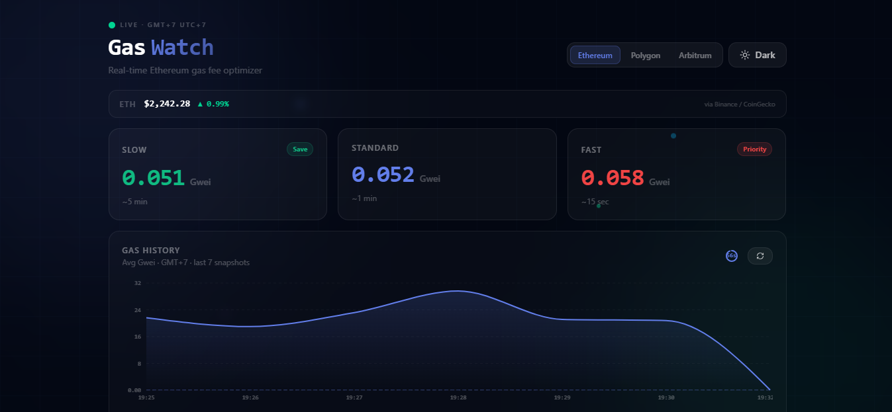
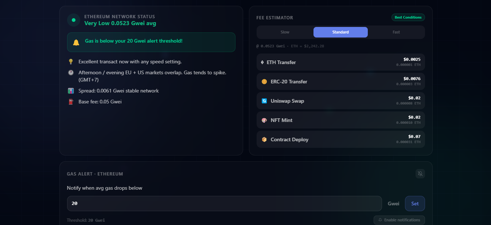
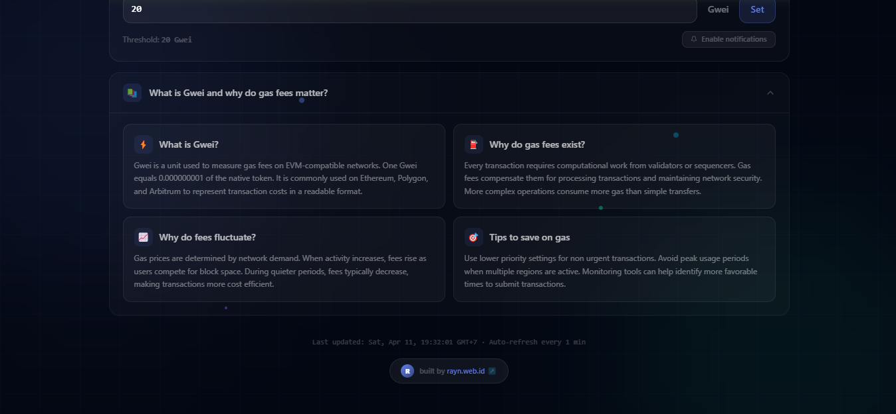

# GasWatch ⛽

Real-time Ethereum gas fee optimizer. Multi-chain, live alerts, smart insights.

🌐 **Live Demo:** [gas-fee-optimizer-delta.vercel.app](https://gas-fee-optimizer-delta.vercel.app)

---

## Screenshots

### Dashboard Overview



Real-time gas prices for Slow / Standard / Fast tiers with ETH price feed and live gas history chart.

### Network Status & Fee Estimator



Network health status, threshold alerts, AI-style insights, and estimated USD cost for common transactions.

### What is Gwei?



Educational section explaining Gwei, why gas fees exist, and tips to save on transaction costs.

---

## What It Does

GasWatch helps you decide **when** to submit an Ethereum (or Polygon / Arbitrum) transaction by showing you live gas prices in Gwei. It tells you whether fees are cheap or expensive right now. No wallet required, no sign-in needed.

- Set a Gwei alert threshold and get highlighted when gas drops below it
- Estimate USD cost for ETH transfer, ERC-20, Uniswap swap, NFT mint, contract deploy
- Timezone-aware insights with hints on when gas tends to be cheaper
- Multi-chain support: Ethereum, Polygon, Arbitrum
- Live ETH price via Binance / CoinGecko

---

## Stack

- **Next.js 16** (App Router, Edge Runtime)
- **Tailwind CSS v4** (PostCSS plugin, CSS-first config)
- **Recharts** (area chart)
- **Lucide React** (icons)
- **TypeScript** (strict mode)

---

## Quick Start

```bash
# 1. Clone & install
git clone https://github.com/your-username/gas-fee-optimizer.git
cd gas-fee-optimizer
npm install

# 2. Copy env template
cp .env.example .env.local

# 3. (Optional) Add your own API keys — app works in simulation mode without them

# 4. Run dev server
npm run dev
```

Open [http://localhost:3000](http://localhost:3000).

---

## API Keys (Optional)

Without keys the app runs in **simulation mode**, still fully functional for demo purposes.

To use real on-chain data, get free keys from:

| Chain    | Source                                                        |
|----------|---------------------------------------------------------------|
| Ethereum | [etherscan.io/myapikey](https://etherscan.io/myapikey)       |
| Polygon  | [polygonscan.com/myapikey](https://polygonscan.com/myapikey) |
| Arbitrum | [arbiscan.io/myapikey](https://arbiscan.io/myapikey)         |

Add to `.env.local`:

```env
ETHERSCAN_API_KEY=your_key_here
POLYGONSCAN_API_KEY=your_key_here
ARBISCAN_API_KEY=your_key_here
```

---

## Project Structure

```
gaswatch/
├── app/
│   ├── api/gas/route.ts     # Edge API, proxies to Etherscan/PolygonScan/Arbiscan
│   ├── api/price/route.ts   # ETH price feed via Binance / CoinGecko
│   ├── globals.css          # Tailwind v4 + keyframes + theme tokens
│   ├── layout.tsx           # Root layout with ThemeProvider + fonts
│   └── page.tsx             # Server component entry
├── components/
│   ├── AnimatedBackground   # Web3 grid + floating orbs
│   ├── AlertPanel           # Gas alert threshold UI
│   ├── ChainSelector        # ETH / Polygon / Arbitrum switcher
│   ├── Dashboard            # Main client component
│   ├── GasCard              # Animated metric card (smooth counter)
│   ├── GasChart             # Recharts area chart, themed
│   ├── GweiExplainer        # What is Gwei? educational section
│   ├── InsightBox           # Context-aware insights with timezone hints
│   ├── ThemeProvider        # Context + localStorage + OS preference
│   ├── ThemeToggle          # Dark/Light button with icon animation
│   └── TxEstimator          # Fee estimator for common tx types
├── hooks/
│   ├── useGasPolling.ts     # Client polling, history, countdown ring
│   └── usePricePolling.ts   # ETH price polling
└── lib/
    ├── chains.ts            # Chain configs (colors, labels, API endpoints)
    ├── getGas.ts            # Server-side gas fetcher + fallback simulation
    └── timezone.ts          # Timezone utilities (auto-detect, GMT label)
```

---

## License

MIT
